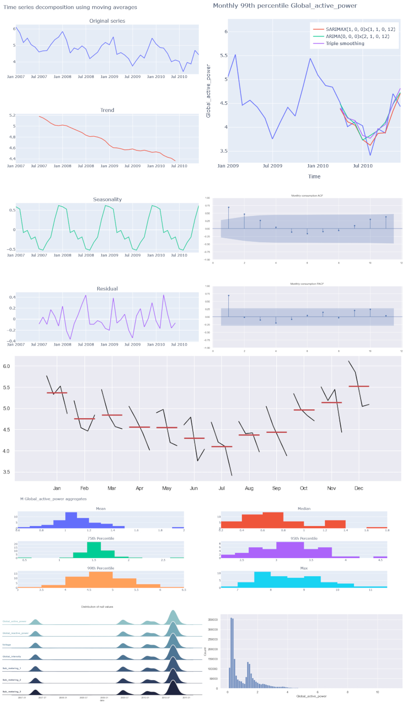

# Household power consumption modeling to size a solar panels system
This work is based on the "Individual household electric power consumption Data Set" from [UCI Machine Learning repository](https://archive.ics.uci.edu/ml/datasets/Individual+household+electric+power+consumption), where measurements of electric power consumption in one household with a one-minute sampling rate over a period of almost 4 years. Different electrical quantities and some sub-metering values are available.

The goal is a hypothetical addition of a solar power system to the house. The sizing of the system will minimize grid reliance in most situations. For simplicity, a few rough assumptions are introduced to simplify this preliminary analysis: namely, the sun is always shining (days and nights) and all the power from the solar panels can be used by the appliances.

To size the system, the power consumption of the entire household is modeled. Finally, a six-months prediction of the power consumption is provided.

- The 99th percentile of the monthly power consumption (99MPC) was analyzed as the metric, as it is both a well-behaved metric, and it captures the functional need of the analysis
- The 99MPC time series shows trend, seasonality, and autocorrelation. **Seasonal decomposition** in trend, seasonal, and residual components of the time series using an **additive model** is very successful in capturing the dynamic of the 99MPC in time
- Winter months (December and January) present the most onerous conditions, with 99MPC peaking
- A **Triple Exponential Smoothing** model is selected as the first tested model, as it captures both trend and seasonality
- From the analysis of the **autocorrelation** function plot and the **partial autocorrelation** function plot, an AR(1) model is selected for the second model (ARMA-based). The prediction of the AR(1) model is not satisfactory, as seasonality is not modeled
- A **SARIMA(1,0,0)x(0,1,1,12)** is tested next. The SARIMA model performs better on this test set, as it can model the seasonality of the series
- Another seasonal **ARIMA** model is fit next, with automated coefficients' selection (minimization of AIC), resulting in a (0,0,0)x(2,1,0,12) model. The performance of this model is very similar to the previous SARIMA model
- **Cross-validation** is used to rank the three promising models (triple exponential smoothing, manual SARIMA, automated ARIMA) on three data splits. Ranking result: SARIMA, Triple Exponential Smoothing, ARIMA. The results are however very similar between the three models
- The 99MPC has a decreasing trend in time, and sizing the system based on past power demand peaks could satisfy the future needs. For example, a **5.5kW** would be appropriate, assuming that power-hungry devices (such as an EV charging station) are not added
- It is unlikely that the general trend will keep decreasing in the future with the same appliances. Rather, the power consumption trend would probably dampen and stabilize to a constant value baseline
- The future prediction for the next six months does not provide significant insights for the solar panels sizing

